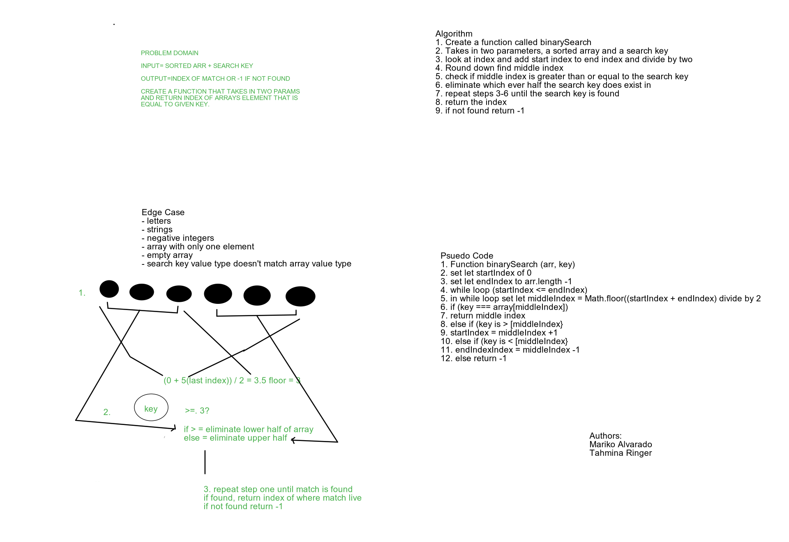

# Array Binary Search
Authours: Mariko Alvarado & Tahmina

Creating a whiteboard to show building out a function that take in two parameters an array and a key and return index of array's element that is equal to given key.

## Challenge

Learning how to create a whiteboard to solve a code challenge.

## Approach & Efficiency

We used a whiteboard tool call AWW app that we mapped out the challenge on using the whiteboard demo.

Used medium.com to solve- 

- Resource 

## Solution

