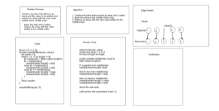

# Shift An Array

Creating a whiteboard to show building out a function that take in an array and a value and adds the value to the middle of the array.

By Tahmina Ringer & Nathan Cox

## Challenge

Learning how to create a whiteboard to solve a code challenge.

## Approach & Efficiency

We used a whiteboard tool call AWW app that we mapped out the challenge on using the whiteboard demo.

## Solution

