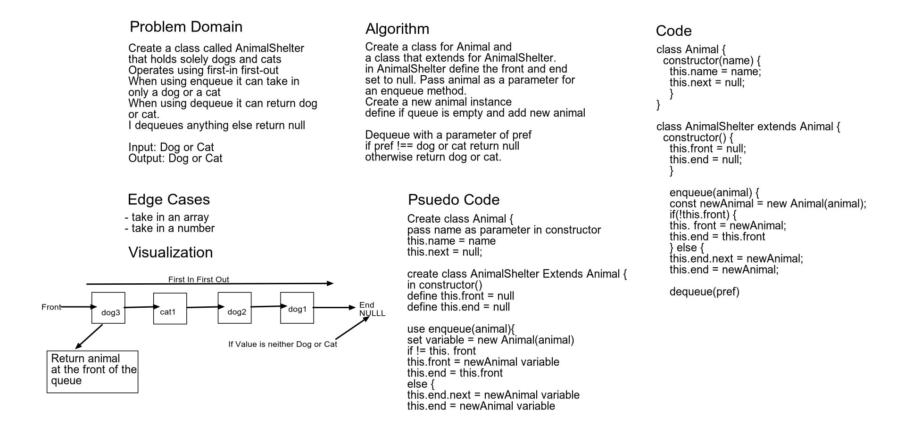

# Code Challenge 12

Create a class called AnimalShelter which holds only dogs and cats. Shelter opperates using a first in first out approach.

By Tahmina Ringer 

## Challenge

To create a class Queue that adds a dog or cat to the queue and returns the a dog or cat that has been enqueued.

## Approach & Efficiency

We used a whiteboard tool call AWW app that we mapped out the challenge on using the whiteboard demo.

## Solution

;
