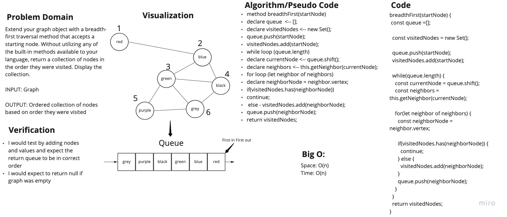

# Graphs

## Challenge 36

Authors: Tahmina Ringer

Extended graph with a breadth-first traversal method that accepts a starting node. Without utilizing any of the built-in methods available to your language, return a collection of nodes in the order they were visited. Display the collection.

- INPUT: Graph
- OUTPUT: Ordered collection of nodes based on order they were visited

## Approach & Efficiency

I wrote my code first and then wrote tests to validate the code.

## Big O

Time - O(n)
Space - O(n)

## Whiteboard

