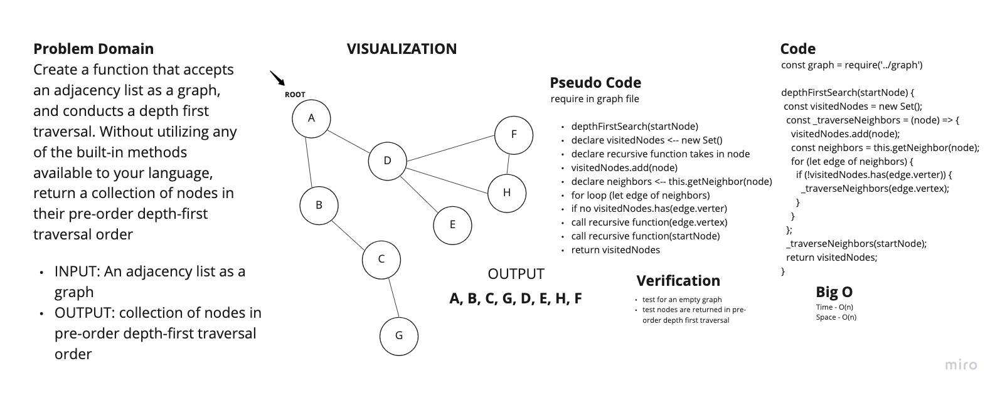

# Depth First

## Challenge 38

Authors: Tahmina Ringer

Create a function that accepts an adjacency list as a graph, and conducts a depth first traversal. Without utilizing any of the built-in methods available to your language, return a collection of nodes in their pre-order depth-first traversal order.

- INPUT: adjacency list as a graph
- OUTPUT: collection of nodes in pre-order depth-first traversal order

## Approach & Efficiency

I wrote my code first and then wrote tests to validate the code.

## Big O

Time - O(n)
Space - O(n)

## Whiteboard

