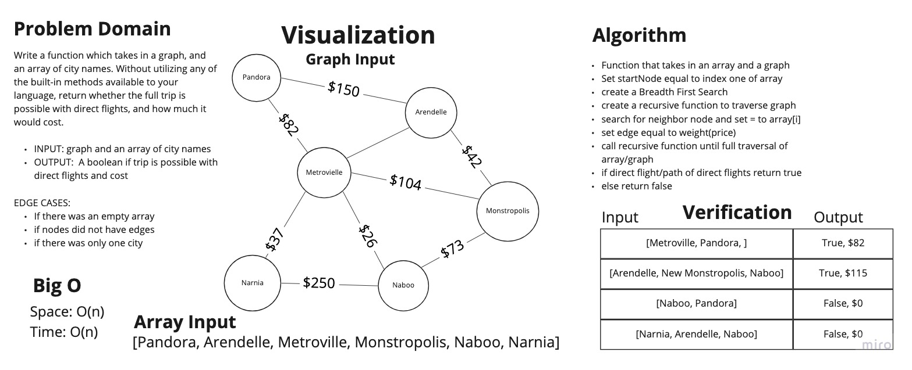

# Binary Trees

## Challenge 36

Authors: Tahmina Ringer

Write a function based on the specifications above, which takes in a graph, and an array of city names. Without utilizing any of the built-in methods available to your language, return whether the full trip is possible with direct flights, and how much it would cost.

- INPUT: Graph and Array of cities
- OUTPUT: boolean for weather the full trip is possible with dirrect flights and weight(cost)

## Approach & Efficiency

I wrote my code first and then wrote tests to validate the code.

## Big O

Time - O(n)
Space - O(n)

## Whiteboard

