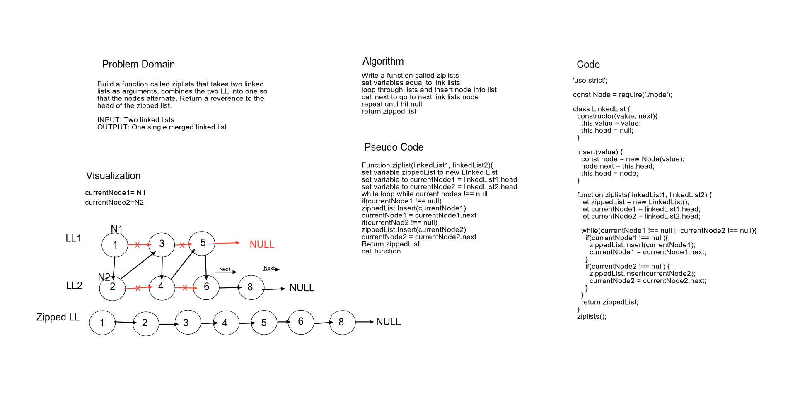

# LL ZIP

Build a function called ziplists that takes two linked lists as arguments, combines the two LL into one so that the nodes alternate. Return a reverence to the head of the zipped list.

By Tahmina Ringer & Sowmya Ballakanti

## Challenge

Learning how to create a whiteboard to solve a code challenge.

## Approach & Efficiency

We used a whiteboard tool call AWW app that we mapped out the challenge on using the whiteboard demo.

## Solution

