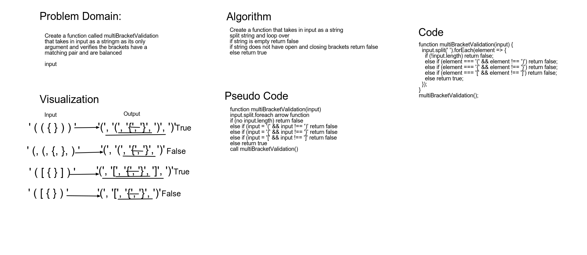

# Multi Bracket Validation

Create a function called multiBracketValidation
that takes in input as a string as its only
argument and verifies the brackets have a
matching pair and are balanced

input= (){}[]
Output= (){}[]

By Tahmina Ringer

## Challenge

write a queue that takes in a 2 stacks
and uses enqueue and dequeue methods
Stack should contain the methods of push 
pop and peek

## Approach & Efficiency

We used a whiteboard tool call AWW app that we mapped out the challenge on using the whiteboard demo.

## Solution

