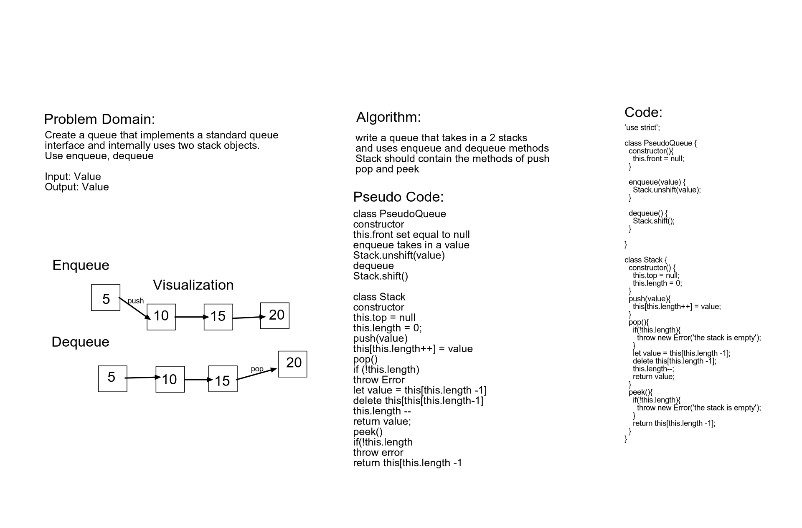

# Queue with Stacks

Create a queue that implements a standard queue 
interface and internally uses two stack objects. 
Use enqueue, dequeue

Input: Value
Output: Value

By Tahmina Ringer

## Challenge

write a queue that takes in a 2 stacks
and uses enqueue and dequeue methods
Stack should contain the methods of push 
pop and peek

## Approach & Efficiency

We used a whiteboard tool call AWW app that we mapped out the challenge on using the whiteboard demo.

## Solution

