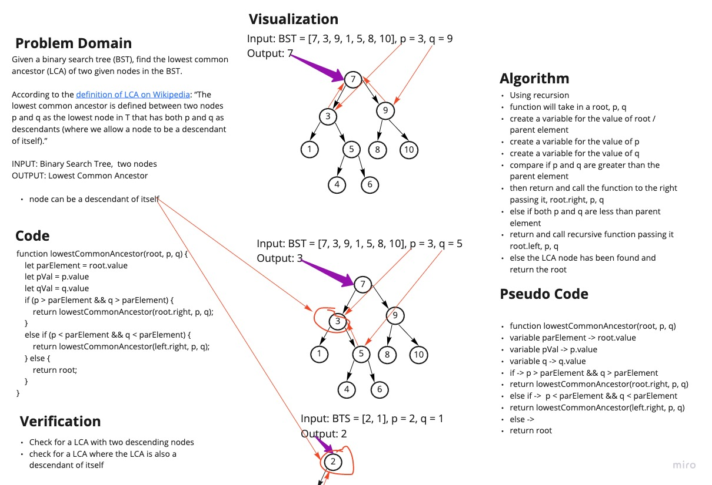

# Lowest Common Ancestor Binary Search Tree

Given a binary search tree (BST), find the lowest common ancestor (LCA) of two given nodes in the BST.

According to the definition of LCA on Wikipedia: “The lowest common ancestor is defined between two nodes p and q as the lowest node in T that has both p and q as descendants (where we allow a node to be a descendant of itself).”

INPUT: Binary Search Tree,  two nodes

OUTPUT: Lowest Common Ancestor

ASSUME: Node can be a descendant of itself

