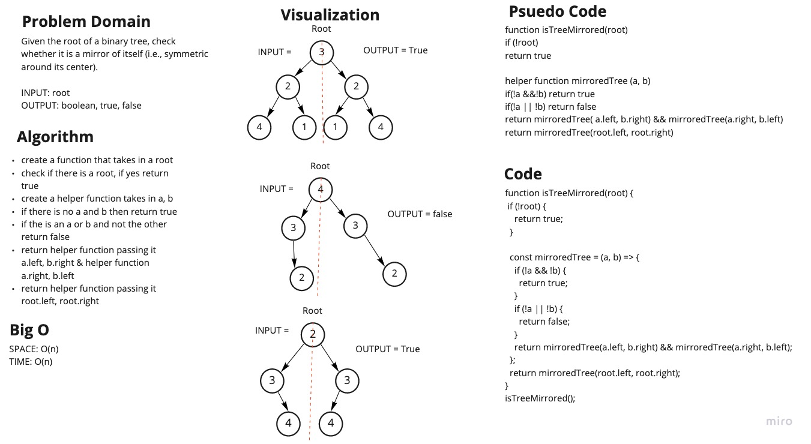

# Symmetric Tree

Given the root of a binary tree, check whether it is a mirror of itself (i.e., symmetric around its center).

INPUT: root

OUTPUT: boolean, true, false

## leatCode Link

- [leetCode](https://leetcode.com/problems/symmetric-tree/)

## Whiteboard

